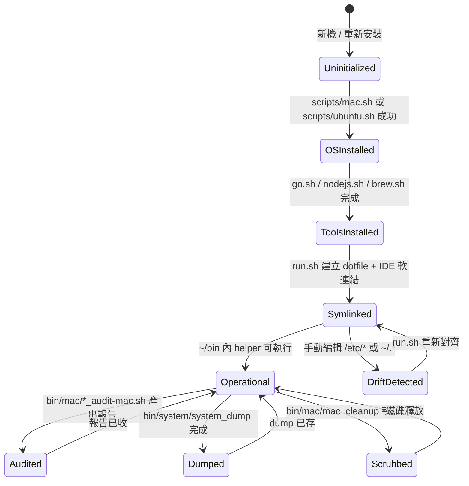

# env_setup — 業務分析 (Business Analysis)

## 業務目的 (Purpose)

替需要在新機器 (macOS / Ubuntu) 快速恢復工作環境的開發者，把「Homebrew / Go / Node / vim / ssh / vscode 等 dotfile 安裝與版本對齊」、「硬體與網路狀態即時偵測」、「macOS 定期安全稽核」與「個人開發者 helper」四件事，集中在單一 repo 內一次設定完成，後續以 `run.sh` 重做軟連結 + pm2 排程維持一致性。

## 常見業務操作 (Common Operations)

- `在新機器一次性建立工作環境 (Bootstrap a new machine)` — 開發者 clone repo、執行 `scripts/mac.sh` 或 `scripts/ubuntu.sh`，把 Homebrew / Go / Node / openssl / ctags 與 git-secret 一次裝好。
- `重做使用者設定與 IDE profile (Re-link user configs and IDE profile)` — 開發者執行 `run.sh`，把 `/etc/*` 與 `~/.*` 重新指向 `bin/`，並把 `bin/vscode/` 套用到 VSCode + Antigravity IDE。
- `查看本機硬體 (Inspect hardware)` — 開發者執行 `bin/system/system_info` 一次看完 10 個硬體子項，或單獨跑 `checkdisk` / `myip` / `list_big_files.sh`。
- `產出 macOS 安全稽核報告 (Generate macOS security audit report)` — 開發者手動跑 `bin/mac/{disk_analysis,launch_audit,login_audit,network_security_audit}-mac.sh`，或由 pm2 週五 05:00 自動觸發，產出 markdown 報告。
- `清理 macOS 磁碟垃圾 (Clean macOS junk)` — 開發者執行 `bin/mac/mac_cleanup`，刪除 `/private/var/log`、`~/Library/Caches`、`~/.Trash`、舊 Time Machine snapshots。
- `掃描本機所連私有網路拓樸 (Scan private network topology)` — 開發者執行 `bin/scan_private_network` 或 `bin/system/network_topology_scan.sh`，traceroute 走到第一個公網 hop，再對最後私有 hop 跑 nmap。
- `匯出 / 還原套件清單 (Dump / restore packages)` — 開發者執行 `bin/system/system_dump` 取得 brew / vscode / agy-ide 清單；亦可單獨跑 `brew_bundle_dump` / `vscode_extension_dump`。
- `排程 (Schedule)` — pm2 讀 `ecosystem.config.js` 註冊 `Golang Clean Cache`、`Disk Analysis`、`Launch Audit`、`Login Audit` (cron 週五) 與 `Port Listenor` / `File Watcher` (常駐)。

## 上下游服務 (Upstream / Downstream)

```mermaid
flowchart LR
    subgraph upstream [上游 Upstream]
        A1[開發者於新機 clone repo]
        A2[Homebrew upstream 5.0.3 tarball]
        A3[go.dev/dl Go 1.26.3 tarball]
        A4[golangci-lint install.sh]
        A5[OS package manager apt/brew]
        A6[/etc/* 系統設定]
    end
    subgraph core [核心業務 Core]
        B1[scripts/* OS installer]
        B2[bin/bash/settings.sh 共用變數]
        B3[run.sh symlink 重建]
        B4[bin/system/* 硬體偵測]
        B5[bin/mac/* 稽核與清理]
        B6[bin/scan_* 網路掃描]
        B7[ecosystem.config.js pm2 cron]
    end
    subgraph downstream [下游 Downstream]
        C1[~/bin 開發者命令列]
        C2[VSCode / Antigravity IDE]
        C3[markdown 稽核報告 $AUDIT_REPORT_DIR]
        C4[pm2 log $HOME/.pm2/logs]
    end
    A1 --> B1
    A2 --> B1
    A3 --> B1
    A4 --> B1
    A5 --> B1
    A6 --> B3
    B1 --> B2
    B2 --> B3
    B2 --> B4
    B2 --> B5
    B2 --> B6
    B7 --> B5
    B1 --> C1
    B3 --> C1
    B3 --> C2
    B4 --> C1
    B5 --> C3
    B6 --> C1
    B7 --> C4
```

## 狀態與流程 (Status / Flow)

本 repo 的核心業務物件是「開發者機器的工作環境 (developer work environment)」，其生命週期如下：



## 業務約束 (Constraints)

- `硬體平台覆蓋 (Hardware coverage)`：腳本需同時支援 macOS (Darwin) 與 Ubuntu Linux；以 `uname` 為單一分支依據 (`scripts/mac.sh` 為 macOS 專屬，`scripts/ubuntu.sh` 為 Ubuntu 專屬)。來源：`scripts/mac.sh:1`、`scripts/ubuntu.sh:1`。
- `Go 版本對齊 (Go version pinning)`：`scripts/go.sh` 寫死 `GO_VER=1.26.3` (來自 `go.sh:20`)，新機部署後會下載對應 tarball 與 `golangci-lint v1.64.5`，避免工具鏈漂移。
- `權限分級 (Privilege tier)`：清理與 service 啟用類腳本 (`bin/mac/mac_cleanup`、`scripts/ubuntu.sh`) 需 `sudo`；硬體偵測 (`bin/system/*_info`) 不需 sudo。`mac_cleanup` 內含 `sudo rm -rf /private/var/log/*` 與 `sudo tmutil deletelocalsnapshots /`。
- `敏感值不入版控 (Secrets out-of-vcs)`：依 `bin/bash/settings.sh:9-14`，明文 `passwd` / `email` / token 改由 git-ignored `~/.config/env_setup/settings.private.sh` 提供；`bin/bytedance_setup.sh` (含明文密碼 + merge conflict markers) 規劃刪除 (`plans/2026-07-08-env-setup-structural-cleanup.md` §4.3.1)。
- `dotfile 唯一來源 (Dotfile single source of truth)`：所有 dotfiles (`.bashrc` / `.vimrc` / `.gitconfig` / `.screenrc` / `.npmrc` / `.toprc`) 由 `scripts/bash_env_setup.sh` 軟連結到 `~/`；修改應直接在 `bin/bash/` 內進行，不直接編輯 `~/` 副本。
- `網路掃描前置依賴 (Network scan deps)`：`bin/scan_private_network` 與 `bin/system/network_topology_scan.sh` 啟動時 `command -v` 檢查 `traceroute` 與 `nmap`；缺一即 `exit 1` 拒絕執行 (`scan_private_network:18-25`)。
- `稽核報告輸出位置 (Audit report location)`：`bin/mac/*_audit-mac.sh` 寫入 `$HOME/.config/system/data/`；`bin/system/network_topology_scan.sh` 寫到 `./report/`。兩處未統一 (見 `plans/2026-07-08` §2.5)。

## 風險偵測 (Risk Detection)

| 風險類別            | 檢查重點                                                                                          |
| :------------------ | :------------------------------------------------------------------------------------------------ |
| 身分/合規 (KYC/AML) | 不適用 — 本 repo 無金流 / 身分處理 (只處理 OS 設定與本機網路)                                    |
| 隱私 (Privacy)      | 有 — `bin/bash/settings.sh` 早期版本含明文 `passwd` / `email`；`bin/bytedance_setup.sh` 含明文密碼 + merge conflict markers；目前已改用 `settings.private.sh` 守衛但**仍需 grep 確認無殘留** |
| 資料完整性          | 有 — `run.sh` 重做 symlink 採用「`[ -L target ]` → 刪後重建」邏輯，若 `target` 是普通檔案會 `continue` 跳過；潛在情境：使用者先前以普通檔案覆蓋了 dotfile，重跑 `run.sh` 不會還原為 symlink，需手動介入 |
| 依賴風險            | 有 — 多個子工具依賴外部 CLI：`traceroute` / `nmap` (網路掃描)、`traceroute` (Hop 探測)；`pm2` 與 `bizshuk/skills` 由 `go install` 在 `run.sh` 內部下載，無網路時 `run.sh` 直接失敗 |

## 核心業務 (Core Business)

- `機器初始化 (Machine Bootstrap)` — 直接決定新機器能否立刻投入開發；`scripts/mac.sh` 與 `scripts/ubuntu.sh` 為單一入口，缺一整個工具鏈無法工作。
- `設定與 IDE profile 軟連結 (Config & IDE symlink)` — 直接決定使用者每天打開的 vim / bash / vscode 體驗是否一致；`run.sh` 為單一入口。
- `硬體與系統狀態偵測 (Hardware probe)` — 直接決定能否在支援工單 / 自我診斷時快速回答「這台機器是什麼」；`bin/system/system_info` 為聚合入口。

## 非核心業務 (Non-core Business)

- `macOS 磁碟清理` (`bin/mac/mac_cleanup`) — 不直接產生開發產出，但能避免磁碟滿載導致 `go build` / Docker 失敗；每週排程可預防問題。
- `macOS 安全稽核` (`bin/mac/*_audit-mac.sh`) — 不直接產生開發產出，但能提早發現 LaunchAgent 異常植入 / 不預期通訊埠開放 / 自動登入開啟等風險，支撐開發者安全作業。
- `網路拓樸掃描` (`bin/scan_private_network` / `bin/system/network_topology_scan.sh`) — 支援離線除錯、VPN 路由驗證；非每日例行但出問題時是主要診斷手段。
- `pm2 排程` (`ecosystem.config.js`) — 把上述稽核 / 清理變成背景任務，避免依賴人為記得執行；本身非業務產出，但支撐稽核與清理的可持續性。
- `開發者 helper 工具` (`bin/json`、`bin/git_signing`、`bin/listen_port` 等) — 提升日常除錯效率；不直接影響環境正確性，屬於輔助 UX。
