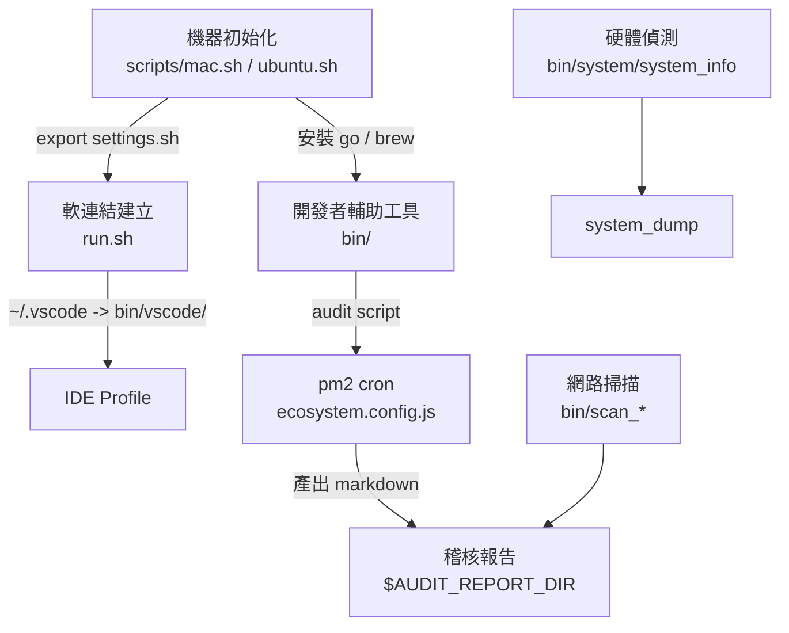

# env_setup

`env_setup` 是一個 framework 層級的機器初始化與開發者工具箱 (developer toolbox) repo：負責在 macOS / Ubuntu 新機器上安裝 OS 與開發工具 (Go, Node, brew, ctags, openssl, git-secret)，把 bash / vim / ssh / vscode 等 dotfiles 透過 `run.sh` 軟連結到使用者家目錄，並提供 `bin/` 內的可執行入口 (硬體偵測、macOS 稽核、網路掃描、開發者 helper) 與 pm2 cron 排程。

## 業務領域 (Business Domains)

### 機器初始化與開發工具安裝 (Machine Bootstrap & Tooling Install)

`scripts/` 下的作業系統級安裝腳本，在新機上一次性建立工具鏈 (Homebrew、Go、Node、ctags、openssl、git-secret)，並由 `bin/bash/settings.sh` 提供 `USER_BIN` / `REPO_SCRIPTS` / `ARCH` 等共用變數。

`領域流程 (Domain Flow):`

1. 使用者在新機器 clone repo 並執行 `./scripts/mac.sh` (或 `./scripts/ubuntu.sh`)。
2. `mac.sh` 內部 `source settings.sh`，再依序呼叫 `bash_env_setup.sh`、`brew.sh`、`go.sh`，並補上 `curl / wget / jq` 與 `uv` (Python toolchain installer)。
3. `brew.sh` 安裝指定版本 Homebrew 並輸出 `~/.bash_plugin`；`go.sh` 下載 `go1.26.3` tarball 解到 `~/.local/`，同時把 `go` 與 `golangci-lint v1.64.5` 軟連結到 `~/bin/`。

`核心實體 (Key Entities):` `安裝腳本 (Install Script)`, `Homebrew`, `Go Toolchain`, `Brewfile`

`相關處理器 (Related Handlers):` [scripts/mac.sh](file:///Users/bytedance/projects/env_setup/scripts/mac.sh), [scripts/ubuntu.sh](file:///Users/bytedance/projects/env_setup/scripts/ubuntu.sh), [scripts/brew.sh](file:///Users/bytedance/projects/env_setup/scripts/brew.sh), [scripts/go.sh](file:///Users/bytedance/projects/env_setup/scripts/go.sh), [scripts/bash_env_setup.sh](file:///Users/bytedance/projects/env_setup/scripts/bash_env_setup.sh)

---

### 使用者與 IDE 設定軟連結 (User Config & IDE Symlink Bootstrap)

`run.sh` 把全機設定 (`/etc/fstab`、`/etc/hosts`、`/etc/sysctl.conf`、`/var/log/auth.log`) 與使用者層級 dotfiles (`~/.config`、`~/.ssh`、`~/.vscode`、`~/.screenrc`、`~/.bash_plugin`、`~/.colima`、`~/lib`) 軟連結到 repo 內 `./tmp/`；同時依 OS (Darwin / Linux) 把 `bin/vscode/{settings,keybindings,snippets}` 套用到 VSCode 與 Antigravity IDE 的 `User/` 目錄。

`領域流程 (Domain Flow):`

1. `run.sh` 先 `go install github.com/bizshuk/pm2@master` 與 `go install github.com/bizshuk/skills@master`，確保後續腳本依賴的工具存在。
2. 讀取 `SYMLINKS` 陣列 (`/etc/*` + `~/.config` 等 17 條)，把已存在的普通檔案跳過、symlink 重新指向。
3. 呼叫 `link_ide_config()`，依 `uname` 結果把 `bin/vscode/` 內容連結到 `${HOME}/Library/Application Support/Code/User` (mac) 或 `${HOME}/.config/Code/User` (linux)，對 VSCode 與 Antigravity IDE 同時生效。

`核心實體 (Key Entities):` `系統設定檔 (System Config File)`, `使用者 dotfiles (User Dotfile)`, `IDE User 目錄 (IDE User Directory)`

`相關處理器 (Related Handlers):` [run.sh](file:///Users/bytedance/projects/env_setup/run.sh), [bin/vscode/settings.json](file:///Users/bytedance/projects/env_setup/bin/vscode/settings.json), [bin/vscode/keybindings.json](file:///Users/bytedance/projects/env_setup/bin/vscode/keybindings.json)

---

### 硬體與系統狀態偵測 (Hardware & System Probe)

`bin/system/` 提供 10 個細粒度 `*_info` 工具 (`os_info`, `cpu_info`, `mem_info`, `gpu_info`, `disk_info`, `display_info`, `usb_info`, `input_info`, `audio_info`, `myip`) 與聚合入口 `system_info`；另有 `checkdisk` (磁碟使用率)、`list_big_files.sh` (大檔掃描)、`system_dump` (統一匯出 brew/vscode/agy-ide 套件清單)、`system_performance.sh` (cheatsheet)。

`領域流程 (Domain Flow):`

1. 使用者直接執行 `bin/system/<tool>`，或呼叫 `system_info` 一次跑完 10 個 sub-tool。
2. 每個 sub-tool 透過 `system_profiler` (mac) 或 `lshw` / `lsblk` (linux) 取出對應章節，印到 stdout。
3. `system_dump` 進一步把 `brew bundle dump`、`vscode_extension_dump`、`agy-ide_extension_dump` 的輸出彙整到 `bin/system/config/` 下的 dump 檔。

`核心實體 (Key Entities):` `硬體元件 (Hardware Component)`, `系統工具輸出 (System Probe Output)`, `Extension 清單 (Extension Manifest)`

`相關處理器 (Related Handlers):` [bin/system/system_info](file:///Users/bytedance/projects/env_setup/bin/system/system_info), [bin/system/system_dump](file:///Users/bytedance/projects/env_setup/bin/system/system_dump), [bin/system/checkdisk](file:///Users/bytedance/projects/env_setup/bin/system/checkdisk), [bin/system/myip](file:///Users/bytedance/projects/env_setup/bin/system/myip), [bin/system/list_big_files.sh](file:///Users/bytedance/projects/env_setup/bin/system/list_big_files.sh)

---

### macOS 系統稽核與清理 (macOS Audit & Cleanup)

`bin/mac/` 提供磁碟清理 (`mac_cleanup.sh`) 與四個安全稽核腳本 (`disk_analysis-mac.sh`、`launch_audit-mac.sh`、`login_audit-mac.sh`、`network_security_audit-mac.sh`)，產出 markdown 報告寫入 `$HOME/.config/system/data/`。

`領域流程 (Domain Flow):`

1. 使用者手動執行 `bin/mac/mac_cleanup.sh`，或由 pm2 在 `0 5 * * 5` (每週五 05:00) 觸發 audit 腳本。
2. `mac_cleanup.sh` 刪 `/private/var/log`、`/private/var/tmp`、`~/Library/Caches`、`~/.Trash`，並 `tmutil deletelocalsnapshots` 與 `docker system prune` (若 docker 存在)。
3. 稽核腳本檢查 `LaunchAgents/LaunchDaemons`、登入帳戶、開啟通訊埠、敏感目錄權限，最後呼叫 `md_log` 寫出帶時間戳的報告。

`核心實體 (Key Entities):` `稽核報告 (Audit Report)`, `磁碟垃圾 (Disk Junk)`, `LaunchAgent`, `開啟通訊埠 (Open Port)`

`相關處理器 (Related Handlers):` [bin/mac/mac_cleanup.sh](file:///Users/bytedance/projects/env_setup/bin/mac/mac_cleanup), [bin/mac/disk_analysis-mac.sh](file:///Users/bytedance/projects/env_setup/bin/mac/disk_analysis-mac.sh), [bin/mac/launch_audit-mac.sh](file:///Users/bytedance/projects/env_setup/bin/mac/launch_audit-mac.sh), [bin/mac/login_audit-mac.sh](file:///Users/bytedance/projects/env_setup/bin/mac/login_audit-mac.sh), [bin/mac/network_security_audit-mac.sh](file:///Users/bytedance/projects/env_setup/bin/mac/network_security_audit-mac.sh)

---

### 網路拓撲與設備掃描 (Network Topology & Device Scan)

`bin/network/scan_network.sh` 為統一入口（`--mode=private|target|topology|topology-no-scan`），用 `traceroute` + `nmap` 探測本機所連私有網段，產出 `network.topo` 或 markdown 拓樸報告。

`領域流程 (Domain Flow):`

1. 入口先 `command -v` 檢查 `traceroute` 與 `nmap` 是否存在；缺一即報錯退出。
2. 透過 `is_private()` 判斷每個 hop 是否位於 RFC1918 / CGNAT (`100.64/10`) 段；持續 traceroute 直到遇見公網 IP。
3. `nmap` 對最後一個私有 hop 進行 port scan；輸出可由 `--topology` 模式進一步輸出成 markdown 拓樸報告。

`核心實體 (Key Entities):` `私有 IP (Private IP)`, `Hop 節點`, `通訊埠掃描結果 (Port Scan Result)`, `網路拓樸報告 (Network Topology Report)`

`相關處理器 (Related Handlers):` [bin/network/scan_network.sh](file:///Users/bytedance/projects/env_setup/bin/network/scan_network.sh), [bin/system/network_topology_scan.sh](file:///Users/bytedance/projects/env_setup/bin/system/network_topology_scan.sh)

---

### 開發者輔助工具 (Developer Helpers)

`bin/` 根目錄與各子目錄的零碎小工具：`json` (pretty-print)、`git_signing` (GPG 簽章指引)、`find_symbolic_link` (找 symlink)、`iconv_big5_utf8` (編碼轉換)、`file_encoding` (編碼偵測)、`check_alive` / `check_service` (健康檢查)、`listen_port` (port 監聽)、`generate_https_cert` / `generator_pem.sh` (憑證)、`backup` / `backupSync` (備份)、`reverse_ln` (反向 symlink)、`ssoLogin.sh` / `ssoLogin_faas.sh` (SSO 登入)、`claudew` / `claudem` (Claude CLI 包裝, 帶 token 與 profile)、`goswitch` (切換 Go 版本)、`mac_keyboard_shortcuts_dump.sh` / `mac_keyboard_shortcuts_restore.sh`、`mac_extension_list.sh`、`ssh_keygen` / `ssh_key_compare` / `ssh_config` / `sshd_config`。

`領域流程 (Domain Flow):`

1. 使用者在 `${HOME}/bin` (symlink 指向 `bin/`) 內直接呼叫 `json < file` 或 `listen_port 8080`。
2. 各工具多為薄殼腳本：呼叫系統 CLI (`nmap` / `traceroute` / `openssl` / `git`) 並加入預設參數。
3. 與 `bin/bash/.bash_aliases` 內的 `claudew-s`, `claudew-b`, `claudew2`, `codexm`, `goswitch` 等 alias 連動；基礎 `claudew` / `claudem` 為 `bin/claudew` / `bin/claudem` 實體 script file；部分具體值由 `~/.bash_local` 個人層級提供。

`核心實體 (Key Entities):` `Helper Script`, `Symlink 目標`, `Bash Alias`

`相關處理器 (Related Handlers):` [bin/json](file:///Users/bytedance/projects/env_setup/bin/json), [bin/git_signing](file:///Users/bytedance/projects/env_setup/bin/git_signing), [bin/listen_port](file:///Users/bytedance/projects/env_setup/bin/listen_port), [bin/mac/mac_keyboard_shortcuts_dump.sh](file:///Users/bytedance/projects/env_setup/bin/mac/mac_keyboard_shortcuts_dump.sh), [bin/bash/.bash_aliases](file:///Users/bytedance/projects/env_setup/bin/bash/.bash_aliases)

---

### 觀測排程與稽核報告 (Observability Cron & Audit Reports)

`ecosystem.config.js` 透過 pm2 註冊一組 `Local` namespace 任務：`Golang Clean Cache` (週五 10:00 跑 `go clean -cache`)、`Disk Analysis` / `Launch Audit` / `Login Audit` (週五 05:00 跑對應 `bin/mac/*` 腳本) 與常駐 `Port Listenor` / `File Watcher`。

`領域流程 (Domain Flow):`

1. pm2 啟動時讀 `ecosystem.config.js` 註冊任務；cron 任務由 pm2 內部排程於指定時間觸發。
2. 稽核類任務以 `./bin/mac/<audit>-mac.sh` 全路徑執行，輸出 markdown 報告。
3. 常駐任務 (`port_listenor monitor`、`file_watcher monitor`) 持續監聽本機服務狀態與檔案異動。

`核心實體 (Key Entities):` `pm2 App`, `Cron 排程`, `稽核報告 (Audit Report)`, `Port 監聽紀錄 (Port Listen Log)`

`相關處理器 (Related Handlers):` [ecosystem.config.js](file:///Users/bytedance/projects/env_setup/ecosystem.config.js), [bin/mac/disk_analysis-mac.sh](file:///Users/bytedance/projects/env_setup/bin/mac/disk_analysis-mac.sh)

---

## 領域關聯 (Domain Relationships)



`機器初始化` 是上游入口，提供 `settings.sh` 共用變數給所有後續腳本；
`軟連結建立` 依賴初始化後的 `~/bin` (已 symlink 到 `bin/`)；
`硬體偵測` 與 `網路掃描` 為 ad-hoc 工具，可單獨執行；
`pm2 cron` 把稽核腳本定期化，產出供 `product/reports/` 集結的 markdown。

## 使用方式 (Usage)

### 1. 機器初始化
```bash
# macOS
./scripts/mac.sh

# Ubuntu
./scripts/ubuntu.sh
```

### 2. 軟連結與 IDE Profile
```bash
./run.sh
```

### 3. 硬體 / 系統偵測
```bash
./bin/system/system_info        # 一次跑 10 個 sub-tool
./bin/system/checkdisk
./bin/system/myip
```

### 4. macOS 稽核與清理
```bash
./bin/mac/mac_cleanup
./bin/mac/disk_analysis-mac.sh
./bin/mac/launch_audit-mac.sh
```

### 5. 網路掃描
```bash
./bin/network/scan_network.sh --mode=private      # 產出 ./network.topo
./bin/network/scan_network.sh --mode=topology
```

### 6. macOS 固定區域網路 IP
```bash
./bin/mac/mac_static_ip.sh status
./bin/mac/mac_static_ip.sh set 192.168.1.100 255.255.255.0 192.168.1.1 1.1.1.1 8.8.8.8
./bin/mac/mac_static_ip.sh dhcp Wi-Fi
```

`status` 會依目前子網路 (subnet) 顯示 `25%-50%` 與 `75%-100%` 的建議 IP 範圍，隨機選出一個可複製的 `mac_static_ip.sh set ...` 指令；指令不含 `--yes`，套用前仍會要求確認。

優先在路由器設定 DHCP reservation，避免固定 IP 與 DHCP pool 內其他裝置衝突。

### 7. 開發者 helper
```bash
./bin/json < bin/system/config/some.json
./bin/listen_port 8080
```

### 8. 啟動排程
```bash
pm2 start ecosystem.config.js
```

## 改善建議 (Improvement Suggestions)

依實際檔案系統分析（參照 `plans/2026-07-08-env-setup-structural-cleanup.md` 的體檢結果）：

- [ ] **修正 `bin/system/system_info:8` 之 `BASE_DIR` 路徑 bug**：目前 `BASE_DIR="$(dirname "$0")/system"` 拼成 `bin/system/system`，sub-tool 全部找不到，執行後立即壞掉；改為 `BASE_DIR="$(dirname "$0")"`，因腳本本身已位於 `bin/system/`。
- [ ] **修正 `bin/system/README.md` 標題與內容錯置**：目前標題寫「安全性稽核與工具」，實際本目錄是 `bin/system/` (硬體偵測)，macOS 稽核腳本在 `bin/mac/`；同步把「`network_topology_scan-mac.sh`」改回 `network_topology_scan.sh`，並把誤指的 `disk_analysis-mac.sh` / `launch_audit-mac.sh` 等條目改歸 `bin/mac/`。
- [x] **三個 network scanner 整合為單一入口**：`bin/scan_private_network`、`bin/scan_target_network` 與 `bin/system/network_topology_scan.sh` 皆跑 traceroute + nmap，職責重疊；以 `bin/network/scan_network.sh --mode=private|target|topology` 取代完成（舊三檔已 git rm，Q5 整合驗證於 `README.todo` @2026-07-09）。
- [ ] **`run.sh` 與 `bin/system/system_link` 目標路徑分歧**：`run.sh` 寫到 `./tmp/`，`system_link` 寫到 `./config/`；兩份 symlink 表實際不同（含 `claude/.claude` 等），規劃合併為 `run.sh` 單一入口並統一目標路徑。
- [ ] **移除 vendored 與 dead code**：`bin/git-secret` (52KB / 2082 行) 改用 `brew install git-secret`；`pkg/ctags-5.8/` (2.2MB / 111 檔) 改為 git submodule；`bin/system/raspi-config` 與 `bin/system/system_service` (一行 dead code) 直接刪除。
- [ ] **安全化 `bin/bash/settings.sh`**：移除明文 `passwd` / `email`，改以 git-ignored `~/.config/env_setup/settings.private.sh` 提供；`.gitignore` 補上 `settings.private.sh`, `.bash_local`, `log/`, `tmp/`。
- [ ] **補 `bin/README.md` 與 `docs/bin_index.md` 索引**：`bin/` 根目錄目前 23 個入口無索引，新工具加入位置無慣例；建立 `bin/<area>/_lib_*.sh` 共用 helper 慣例並寫入文件。
