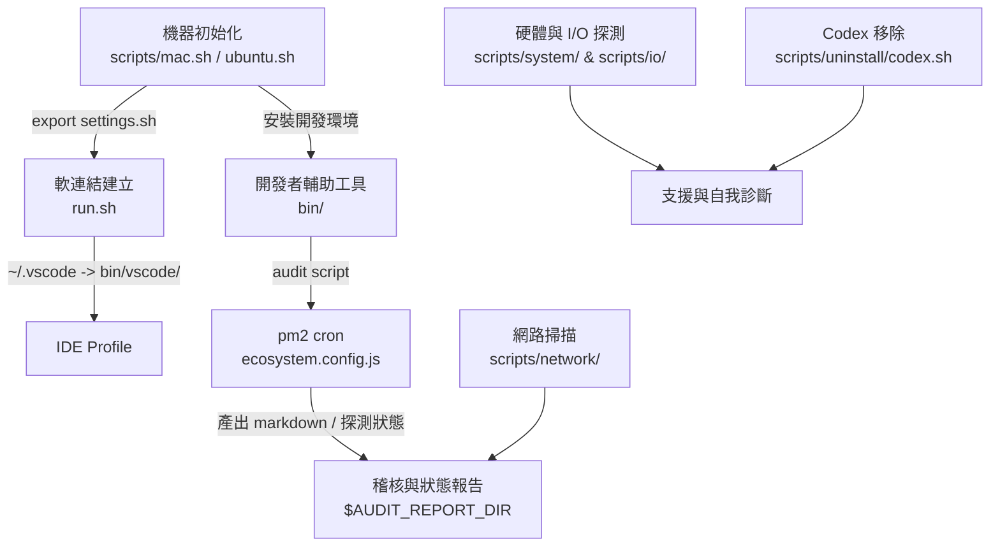

# env_setup

`env_setup` 是一個 framework 層級的機器初始化與開發者工具箱 (developer toolbox) repo：負責在 macOS / Ubuntu 新機器上安裝 OS 與開發工具 (Go, Node, brew, ctags, openssl, git-secret)，把 bash / vim / ssh / vscode 等 dotfiles 透過 `run.sh` 軟連結到使用者家目錄，並透過 `scripts/<domain>/` 純 Shell 腳本與 `package.json` npm scripts 提供 install、uninstall、dump、system、io、cleanup、backup 與 network 任務；`bin/` 保留 macOS 稽核與開發者 helpers，pm2 負責 cron 排程。

## 業務領域 (Business Domains)

### 機器初始化與開發工具安裝 (Machine Bootstrap & Tooling Install)

`scripts/` 下的作業系統級安裝腳本，在新機上一次性建立工具鏈 (Homebrew、Go、Node、ctags、openssl、git-secret)，並由 `bin/bash/settings.sh` 提供 `USER_BIN` / `REPO_SCRIPTS` / `ARCH` 等共用變數。

`領域流程 (Domain Flow):`

1. 使用者在新機器 clone repo 並執行 `./scripts/mac.sh` (或 `./scripts/ubuntu.sh`)。
2. `mac.sh` 內部 `source settings.sh`，再依序呼叫 `bash_env_setup.sh`、`brew.sh`、`go.sh`，並補上 `curl / wget / jq` 與 `uv` (Python toolchain installer)。
3. `brew.sh` 安裝指定版本 Homebrew 並輸出 `~/.bash_plugin`；`go.sh` 下載 `go1.26.6` tarball 解到 `~/.local/`，同時把 `go` 軟連結到 `~/bin/`。

`核心實體 (Key Entities):` `安裝腳本 (Install Script)`, `Homebrew`, `Go Toolchain`, `Brewfile`

`相關處理器 (Related Handlers):` [scripts/mac.sh](scripts/mac.sh), [scripts/ubuntu.sh](scripts/ubuntu.sh), [scripts/brew.sh](scripts/brew.sh), [scripts/go.sh](scripts/go.sh), [scripts/bash_env_setup.sh](scripts/bash_env_setup.sh)

---

### 使用者與 IDE 設定軟連結 (User Config & IDE Symlink Bootstrap)

`run.sh` 把全機設定 (`/etc/fstab`、`/etc/hosts`、`/etc/sysctl.conf`、`/var/log/auth.log`) 與使用者層級 dotfiles (`~/.config`、`~/.ssh`、`~/.vscode`、`~/.screenrc`、`~/.bash_plugin`、`~/.colima`、`~/lib`) 軟連結到 repo 內 `./tmp/`；同時依 OS (Darwin / Linux) 把 `bin/vscode/{settings,keybindings,snippets}` 套用到 VSCode 與 Antigravity IDE 的 `User/` 目錄。

`領域流程 (Domain Flow):`

1. `run.sh` 先執行 `scripts/default_tools.sh`，確保後續腳本依賴的工具 (pm2 等) 存在。
2. 讀取 `SYMLINKS` 陣列 (`/etc/*` + `~/.config` 等 17 條)，把已存在的普通檔案跳過、symlink 重新指向。
3. 呼叫 `link_ide_config()`，依 `uname` 結果把 `bin/vscode/` 內容連結到 `${HOME}/Library/Application Support/Code/User` (mac) 或 `${HOME}/.config/Code/User` (linux)，對 VSCode 與 Antigravity IDE 同時生效。

`核心實體 (Key Entities):` `系統設定檔 (System Config File)`, `使用者 dotfiles (User Dotfile)`, `IDE User 目錄 (IDE User Directory)`

`相關處理器 (Related Handlers):` [run.sh](run.sh), [bin/vscode/settings.json](bin/vscode/settings.json), [bin/vscode/keybindings.json](bin/vscode/keybindings.json)

---

### 硬體與系統狀態偵測 (Hardware & System Probe)

`scripts/system/` 是硬體與系統狀態的統一探測工具集；`system/show.sh` 聚合全部 10 個 probes，每種 information 也有獨立的探測腳本（如 `cpu.sh`、`memory.sh`、`disk.sh`、`network.sh` 等）。`system/disk_verify.sh` 在 macOS 以 `diskutil`、`f3write` 與 `f3read` 驗證 removable media 的容量與資料完整性。由 `package.json` 的 `npm run run:system:*` 提供統一任務入口。

`領域流程 (Domain Flow):`

1. 使用者執行 `npm run run:system:show` (或 `./scripts/system/show.sh`) 查看聚合報告，亦可指定單一 probe 如 `npm run run:system:cpu` 查看特定資訊。
2. 腳本依 runtime platform 執行 `system_profiler` / `sysctl`（macOS）或對應 Linux commands (`lshw`, `lscpu` 等)，格式化後輸出至 stdout。
3. 使用者執行 `npm run run:system:disk-verify -- /Volumes/<name>` (或 `./scripts/system/disk_verify.sh /Volumes/<name>`)，確認 F3 write/read 操作後驗證 removable media；`--yes` 可略過互動確認。

`核心實體 (Key Entities):` `硬體元件 (Hardware Component)`, `系統工具輸出 (System Probe Output)`

`相關處理器 (Related Handlers):` [scripts/system/show.sh](scripts/system/show.sh), [scripts/system/disk_verify.sh](scripts/system/disk_verify.sh), [scripts/system/](scripts/system/), `npm run run:system:*`

---

### 裝置層 I/O 探測 (Device I/O Probe)

`scripts/io/probe.sh` 以磁碟為單位回答「這顆碟扛不扛得住 fsync 密集的工作（docker、registry、資料庫）」：每顆實體磁碟一列，欄位 `DEV / TRAN / ID / MODEL / SIZE / LINK / DRIVER / QD / WCACHE / ROTA / MOUNTS`。Linux 由 `lsblk` 與 sysfs 取得（USB 會顯示 vendor:product、link 速率、`uas` 或 `usb-storage`、queue depth 與 write cache），macOS 由 `diskutil` 取得。`scripts/io/bench.sh` 進行循序寫入與延遲測試。由 `npm run run:io:*` 提供統一任務入口。

`領域流程 (Domain Flow):`

1. 使用者執行 `npm run run:io:probe` (或 `./scripts/io/probe.sh`)，先看表格判斷瓶頸來源（例如 `usb-storage` + `QD 2` + `write through` 就是隨身碟等級）。
2. 需要數字時執行 `npm run run:io:bench -- /Volumes/target` (或 `./scripts/io/bench.sh --dir DIR`)：在指定目錄寫暫存檔量測循序寫入與讀取速度，略過 page cache，測完自動刪檔。
3. 以同步寫入 IOPS 判斷：數十 IOPS 只能放冷資料，上千 IOPS 才適合 container / DB。

`核心實體 (Key Entities):` `區塊裝置 (Block Device)`, `延遲樣本 (Latency Sample)`

`相關處理器 (Related Handlers):` [scripts/io/probe.sh](scripts/io/probe.sh), [scripts/io/bench.sh](scripts/io/bench.sh), `npm run run:io:*`

---

### 開發環境清單同步 (Development Manifest Sync)

`scripts/dump/` 將目前機器的 Homebrew 與 IDE extension 狀態寫回 repo 內的 canonical manifests：`mac.sh` 更新 `scripts/Brewfile`；`vscode.sh` 與 `antigravity.sh` 分別更新 `bin/vscode/*_extension_list.txt`。`scripts/install/` 則依 tracked manifest 安裝對應 IDE 的 extensions，並在移除未列管 extensions 前要求明確確認。由 `npm run run:dump:*` 與 `npm run run:install:*` 提供統一任務入口。

`領域流程 (Domain Flow):`

1. 使用者在 repo 內執行 `npm run run:dump:mac`、`npm run run:dump:vscode` 或 `npm run run:dump:antigravity` (或直接執行 `scripts/dump/*.sh`)。
2. 腳本先驗證 repo root 與必要 CLI，再執行 `brew bundle dump` 或 `<ide> --list-extensions`。
3. IDE manifests 會排序、去重並以原子覆寫方式寫入，external command 失敗時保留舊檔。
4. 使用者執行 `npm run run:install:vscode` 或 `npm run run:install:antigravity` (或直接執行 `scripts/install/*.sh`) 時，逐項安裝 manifest entries；未列管的 extensions 只有在回答 `y` 確認後才會被移除。

`核心實體 (Key Entities):` `Mac Manifest`, `IDE Extension Manifest`, `Extension Sync`, `Repository Root`

`相關處理器 (Related Handlers):` [scripts/dump/mac.sh](scripts/dump/mac.sh), [scripts/dump/vscode.sh](scripts/dump/vscode.sh), [scripts/dump/antigravity.sh](scripts/dump/antigravity.sh), [scripts/install/vscode.sh](scripts/install/vscode.sh), [scripts/install/antigravity.sh](scripts/install/antigravity.sh), `npm run run:dump:*`, `npm run run:install:*`

---

### macOS 設定備份 (macOS Defaults Backup)

`scripts/backup/` 以 macOS `defaults` / `plutil` 匯出 tracked domains 的偏好設定為 `.plist` snapshot，供重灌或換機後還原：`list.sh` 顯示最近一次快照時間與每個 domain 的狀態，`import.sh` 還原，`init.sh` 建立預設的 domain manifest，`backup.sh` 執行備份快照。由 `npm run run:backup:*` 提供統一任務入口。

`領域流程 (Domain Flow):`

1. 使用者執行 `npm run run:backup:init` (或 `./scripts/backup/init.sh`) 建立預設的 domain manifest `~/.config/env_setup/mac_backup_domains.json`。
2. 使用者執行 `npm run run:backup` (或 `./scripts/backup/backup.sh`) 匯出 tracked domains；每個 domain 寫成一份 `.plist`，並更新 metadata 的 snapshot timestamp。
3. 使用者執行 `npm run run:backup:list` (或 `./scripts/backup/list.sh`) 檢視 latest backup date 與 domain status；缺少 metadata 的 legacy backup 才 fallback 到最新 `.plist` 的 modification time，完全沒有 backup 時顯示 `-`。
4. 使用者在新機執行 `npm run run:backup:import` (或 `./scripts/backup/import.sh`) 把 snapshot 寫回 macOS defaults；預設先顯示 diff 再逐一確認，`--yes` 全部同意、`--no-diff` 不顯示 diff。

`核心實體 (Key Entities):` `Backup Domain`, `Backup Manifest`, `Backup Snapshot`

`相關處理器 (Related Handlers):` [scripts/backup/backup.sh](scripts/backup/backup.sh), [scripts/backup/list.sh](scripts/backup/list.sh), [scripts/backup/import.sh](scripts/backup/import.sh), [scripts/backup/init.sh](scripts/backup/init.sh), `npm run run:backup:*`

---

### macOS Codex 移除 (macOS Codex Uninstall)

`scripts/uninstall/codex.sh` 以 preview-first workflow 管理 Codex desktop app、per-user CLI、`~/.codex`、Library data 與 matching user launchd services。預設只列出 targets；只有加上 `--apply` 才逐項詢問 `[y/N]` 並移除明確同意的 target。由 `npm run run:uninstall:codex` 提供統一任務入口。

`領域流程 (Domain Flow):`

1. 使用者先執行 `npm run run:uninstall:codex` (或 `./scripts/uninstall/codex.sh`)，查看 app、CLI、configuration、cache、preferences、containers 與 launchd targets；此時不會 quit app 或修改檔案。
2. `--with-codexbar` 將 `/Applications/CodexBar.app` 納入 scope；`--purge-system` 將 matching `/Library` launchd files 與 `/etc/codex` 納入需要 `sudo` 的 scope。
3. 使用者加上 `--apply` 後，每個 available target 都必須個別確認後始執行移除。

`核心實體 (Key Entities):` `Codex Uninstall Plan`, `Exact Target`, `Optional Uninstall Scope`, `launchd Label`

`相關處理器 (Related Handlers):` [scripts/uninstall/codex.sh](scripts/uninstall/codex.sh), `npm run run:uninstall:codex`

---

### macOS 系統稽核與清理 (macOS Audit & Cleanup)

`scripts/cleanup/` 提供系統與快取清理；預設為 safe-by-default preview，加上 `--apply` 才進行確認清理。`bin/mac/` 保留三個安全稽核腳本 (`launch_audit-mac.sh`、`login_audit-mac.sh`、`network_security_audit-mac.sh`)，產出 markdown 報告寫入 `$HOME/.config/env_setup/data/audit/` (可由 `AUDIT_REPORT_DIR` 覆寫)。由 `npm run run:cleanup` 與 `npm run run:cleanup:<target>` 提供統一任務入口。

`領域流程 (Domain Flow):`

1. 使用者先執行 `npm run run:cleanup` (或 `./scripts/cleanup/all.sh`)，查看每個 cleanup item 的 size 與 description；preview 不修改檔案。亦可透過 `npm run run:cleanup:<target>` 針對特定類別 (如 `docker`, `brew`, `node` 等) 檢視。
2. 使用者執行 `npm run run:cleanup -- --apply` (或腳本加上 `--apply`) 後，才逐項顯示 `[y/N]` confirmation，且只套用明確同意的 item。
3. pm2 依分散排程 (週五 04:00~04:30、週六 05:00) 觸發 audit scripts 與 cleanup preview；稽核腳本檢查 `LaunchAgents/LaunchDaemons`、登入帳戶、開啟通訊埠與敏感目錄權限，再寫出帶時間戳的報告。

`核心實體 (Key Entities):` `稽核報告 (Audit Report)`, `磁碟垃圾 (Disk Junk)`, `LaunchAgent`, `開啟通訊埠 (Open Port)`

`相關處理器 (Related Handlers):` [scripts/cleanup/all.sh](scripts/cleanup/all.sh), [bin/mac/launch_audit-mac.sh](bin/mac/launch_audit-mac.sh), [bin/mac/login_audit-mac.sh](bin/mac/login_audit-mac.sh), [bin/mac/network_security_audit-mac.sh](bin/mac/network_security_audit-mac.sh), [scripts/cleanup/](scripts/cleanup/), `npm run run:cleanup:*`

---

### 網路拓撲與設備掃描 (Network Topology & Device Scan)

`scripts/network/` 提供網路掃描任務：`private.sh` 以 `traceroute` + `nmap` 分析本機所連私有網段並產出 `network.topo`；`target.sh` 對指定 IPv4 CIDR 執行 host discovery。由 `npm run run:network:private` 與 `npm run run:network:target` 提供統一任務入口。

`領域流程 (Domain Flow):`

1. 執行 `npm run run:network:private` (或 `./scripts/network/private.sh`) 先檢查 `traceroute` 與 `nmap`；`npm run run:network:target` (或 `./scripts/network/target.sh`) 優先使用 `nmap`，缺少時只對 `/24` 或更小的 IPv4 network 使用 bounded ping fallback。
2. 腳本判斷每個 hop 是否位於 RFC1918 / CGNAT (`100.64/10`) 段；持續 traceroute 直到遇見公網 IP。
3. `nmap` 對私有 subnet 進行 host / port discovery；`private` 寫入 topology file，`target` 將 live hosts 印到 stdout。

`核心實體 (Key Entities):` `私有 IP (Private IP)`, `Hop 節點`, `通訊埠掃描結果 (Port Scan Result)`, `網路拓樸報告 (Network Topology Report)`

`相關處理器 (Related Handlers):` [scripts/network/private.sh](scripts/network/private.sh), [scripts/network/target.sh](scripts/network/target.sh), `npm run run:network:*`

---

### 開發者輔助工具 (Developer Helpers)

`bin/` 根目錄與各子目錄的零碎小工具：`json` (pretty-print)、`git_signing` (GPG 簽章指引)、`find_symbolic_link` (找 symlink)、`iconv_big5_utf8` (編碼轉換)、`file_encoding` (編碼偵測)、`generate_https_cert` / `generator_pem.sh` (憑證)、`backup` / `backupSync` (備份)、`reverse_ln` (反向 symlink)、`ssoLogin.sh` / `ssoLogin_faas.sh` (SSO 登入)、`claudew` / `claudem` (Claude CLI 包裝, 帶 token 與 profile)、`mac_keyboard_shortcuts_dump.sh` / `mac_keyboard_shortcuts_restore.sh`、`mac_extension_list.sh`、`ssh_keygen` / `ssh_key_compare` / `ssh_config` / `sshd_config`。

`領域流程 (Domain Flow):`

1. 使用者在 `${HOME}/bin` (symlink 指向 `bin/`) 內直接呼叫 `json < file` 或 `find_symbolic_link ~/bin`。
2. 各工具多為薄殼腳本：呼叫系統 CLI (`nmap` / `traceroute` / `openssl` / `git`) 並加入預設參數。
3. 與 LLM CLI alias (`claude*` / `codex*`) 連動：這組 alias 的唯一擁有者是 `~/projects/ai/cc-plugin/scripts/aliases.sh`，`bin/bash/.bash_aliases` 只負責 source 它；基礎 `claudew` / `claudem` 為 `bin/claudew` / `bin/claudem` 實體 script file；alias 引用的 token 變數由 git-ignored 的 `~/.bash_local` 提供。

`核心實體 (Key Entities):` `Helper Script`, `Symlink 目標`, `Bash Alias`

`相關處理器 (Related Handlers):` [bin/json](bin/json), [bin/git_signing](bin/git_signing), [bin/find_symbolic_link](bin/find_symbolic_link), [bin/mac/mac_keyboard_shortcuts_dump.sh](bin/mac/mac_keyboard_shortcuts_dump.sh), [bin/bash/.bash_aliases](bin/bash/.bash_aliases)

---

### 觀測排程與稽核報告 (Observability Cron & Audit Reports)

`ecosystem.config.js` 透過 pm2 註冊一組 `Local` namespace 的非安裝類檢測任務：`Disk Cleanup Preview` (`./scripts/cleanup/all.sh`)、安全稽核 (`Launch Audit` / `Login Audit` / `Network Security Audit`)、`System Health Probe` (`./scripts/system/show.sh`)、`Storage Device Probe` (`./scripts/io/probe.sh`)、`Backup Status Audit` (`./scripts/backup/list.sh`)、`Energy Wakeup Probe` (`./scripts/system/energy.sh`) 與 `Private Route Topology` (`./scripts/network/private.sh`)。

`領域流程 (Domain Flow):`

1. pm2 啟動時讀取 `ecosystem.config.js` 註冊任務；cron 任務依分散離峰時間 (週一至週六各時段) 由 pm2 內部排程週期性觸發，避免並行衝突。
2. 稽核類任務以 `./bin/mac/<audit>-mac.sh` 全路徑執行，輸出 markdown 報告至 `$HOME/.config/env_setup/data/audit/`。
3. 檢測類任務以 `./scripts/<domain>/<tool>.sh` 全路徑執行，記錄健康狀態、儲存裝置規格與備份清單。

`核心實體 (Key Entities):` `pm2 App`, `Cron 排程`, `稽核報告 (Audit Report)`, `Cleanup Preview`

`相關處理器 (Related Handlers):` [ecosystem.config.js](ecosystem.config.js), [bin/mac/launch_audit-mac.sh](bin/mac/launch_audit-mac.sh), [scripts/cleanup/all.sh](scripts/cleanup/all.sh)

---

## 領域關聯 (Domain Relationships)


```mermaid
flowchart TD
    Bootstrap["機器初始化<br/>scripts/mac.sh / ubuntu.sh"] -->|"export settings.sh"| Symlink["軟連結建立<br/>run.sh"]
    Bootstrap -->|"安裝開發環境"| Helpers["開發者輔助工具<br/>bin/<tool>"]
    Symlink -->|"~/.vscode -> bin/vscode/"| IDE["IDE Profile"]
    Helpers -->|"audit script"| Cron["pm2 cron<br/>ecosystem.config.js"]
    Cron -->|"產出 markdown / 探測狀態"| Reports["稽核與狀態報告<br/>$AUDIT_REPORT_DIR"]
    Hardware["硬體與 I/O 探測<br/>scripts/system/ & scripts/io/"] --> Support["支援與自我診斷"]
    Uninstall["Codex 移除<br/>scripts/uninstall/codex.sh"] --> Support
    Network["網路掃描<br/>scripts/network/"] --> Reports
```

`機器初始化` 是上游入口，提供 `settings.sh` 共用變數給所有後續腳本；
`軟連結建立` 依賴初始化後的 `~/bin` (已 symlink 到 `bin/`)；
`硬體探測` 與 `網路掃描` 為 ad-hoc 工具，可單獨執行；
`pm2 cron` 把稽核與探測腳本定期化，產出供檢視的報告。

## 使用方式 (Usage)

### 1. 機器初始化
```bash
# macOS
./scripts/mac.sh

# Ubuntu
./scripts/ubuntu.sh
```

### 2. 軟連結與 IDE Profile
```bash
./run.sh
```

### 3. 硬體 / 系統偵測

```bash
# npm run (推薦)
npm run run:system:show
npm run run:system:cpu
npm run run:system:network
npm run run:system:disk-verify -- /Volumes/backup

# 直接執行腳本
./scripts/system/show.sh
./scripts/system/cpu.sh
./scripts/system/disk_verify.sh /Volumes/backup
```

### 3.1 同步開發環境清單

```bash
# npm run (推薦)
npm run run:dump:mac
npm run run:dump:vscode
npm run run:dump:antigravity
npm run run:install:vscode
npm run run:install:antigravity

# 直接執行腳本
./scripts/dump/mac.sh
./scripts/dump/vscode.sh
./scripts/dump/antigravity.sh
./scripts/install/vscode.sh
./scripts/install/antigravity.sh
```

### 3.2 macOS Codex 移除

```bash
# npm run (推薦)
npm run run:uninstall:codex                          # preview only
npm run run:uninstall:codex -- --apply               # 逐項確認

# 直接執行腳本
./scripts/uninstall/codex.sh                         # preview only
./scripts/uninstall/codex.sh --apply                 # 逐項確認
./scripts/uninstall/codex.sh --with-codexbar         # preview CodexBar scope
./scripts/uninstall/codex.sh --purge-system          # preview sudo scope
```

### 3.3 裝置層 I/O 探測

```bash
# npm run (推薦)
npm run run:io:probe
npm run run:io:bench -- /Volumes/backup

# 直接執行腳本
./scripts/io/probe.sh
./scripts/io/bench.sh --dir /Volumes/backup
```

### 4. macOS 稽核與清理
```bash
# npm run (推薦)
npm run run:cleanup                                  # preview all
npm run run:cleanup -- --apply                       # 逐項確認清理
npm run run:cleanup:docker

# 直接執行腳本
./scripts/cleanup/all.sh                             # preview all
./scripts/cleanup/all.sh --apply                     # 逐項確認清理
./scripts/cleanup/docker.sh

./bin/mac/launch_audit-mac.sh
./bin/mac/login_audit-mac.sh
```

### 4.1 macOS 設定備份

```bash
# npm run (推薦)
npm run run:backup
npm run run:backup:list                              # 顯示 latest backup date 與 domain status
npm run run:backup:import
npm run run:backup:init

# 直接執行腳本
./scripts/backup/backup.sh
./scripts/backup/list.sh
./scripts/backup/import.sh
./scripts/backup/init.sh
```

### 5. 網路掃描

```bash
# npm run (推薦)
npm run run:network:private
npm run run:network:target -- 192.168.1.0/24

# 直接執行腳本
./scripts/network/private.sh                         # traceroute 至 8.8.8.8，產出 ./network.topo
./scripts/network/target.sh 192.168.1.0/24
```

### 6. macOS 固定區域網路 IP
```bash
./bin/mac/mac_static_ip.sh status
./bin/mac/mac_static_ip.sh set 192.168.1.100 255.255.255.0 192.168.1.1 1.1.1.1 8.8.8.8
./bin/mac/mac_static_ip.sh dhcp Wi-Fi
```

`status` 會依目前子網路 (subnet) 顯示 `25%-50%` 與 `75%-100%` 的建議 IP 範圍，隨機選出一個可複製的 `mac_static_ip.sh set ...` 指令，並在下一行顯示 `mac_static_ip.sh dhcp <service>` 還原指令；設定指令不含 `--yes`，套用前仍會要求確認。

優先在路由器設定 DHCP reservation，避免固定 IP 與 DHCP pool 內其他裝置衝突。

### 7. 開發者 helper
```bash
./bin/json < ./some.json
./bin/find_symbolic_link ~/bin
```

### 8. 啟動排程
```bash
pm2 start ecosystem.config.js
```

## 改善建議 (Improvement Suggestions)

依實際檔案系統分析（參照 `docs/specs/2026-07-08-env-setup-structural-cleanup.md` 的體檢結果）：

- [x] **移除 system shell adapter layer 並整合成純 Shell 領域腳本**：硬體與系統探測全面由 `scripts/system/*.sh` 提供，並以 `npm run run:system:*` 作為統一入口。
- [x] **移除 network shell adapter layer 並整合成純 Shell 領域腳本**：網路拓撲與目標網段掃描全面由 `scripts/network/*.sh` 提供，並以 `npm run run:network:*` 作為統一入口。
- [x] **合併舊 system link 邏輯**：`run.sh` 是唯一 symlink setup 入口，目標統一為 `./tmp/`。
- [x] **移除 vendored 與 dead code**：`git-secret` 改用 package manager，舊 Raspberry Pi / service one-liners 與其他 dead scripts 已移除。
- [x] **安全化 `bin/bash/settings.sh`**：明文 `passwd` / `email` 已移除，改由 git-ignored `~/.config/env_setup/settings.private.sh` 提供；`.gitignore` 已含 `settings.private.sh`, `.bash_local`, `log/`, `tmp/`。
- [x] **補 `bin/README.md` 與 `docs/bin_index.md` 索引**：兩份索引皆已建立，`bin/<area>/_lib_*.sh` 共用 helper 慣例已寫入 `CLAUDE.md` 與 `bin/README.md`。
