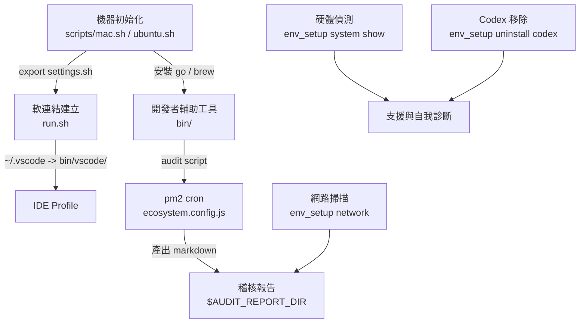

# env_setup

`env_setup` 是一個 framework 層級的機器初始化與開發者工具箱 (developer toolbox) repo：負責在 macOS / Ubuntu 新機器上安裝 OS 與開發工具 (Go, Node, brew, ctags, openssl, git-secret)，把 bash / vim / ssh / vscode 等 dotfiles 透過 `run.sh` 軟連結到使用者家目錄，並以 `env_setup` Go CLI 提供 install、uninstall、dump、system、cleanup、backup 與 network commands；`bin/` 保留 macOS 稽核與開發者 helpers，pm2 負責 cron 排程。

## 業務領域 (Business Domains)

### 機器初始化與開發工具安裝 (Machine Bootstrap & Tooling Install)

`scripts/` 下的作業系統級安裝腳本，在新機上一次性建立工具鏈 (Homebrew、Go、Node、ctags、openssl、git-secret)，並由 `bin/bash/settings.sh` 提供 `USER_BIN` / `REPO_SCRIPTS` / `ARCH` 等共用變數。

`領域流程 (Domain Flow):`

1. 使用者在新機器 clone repo 並執行 `./scripts/mac.sh` (或 `./scripts/ubuntu.sh`)。
2. `mac.sh` 內部 `source settings.sh`，再依序呼叫 `bash_env_setup.sh`、`brew.sh`、`go.sh`，並補上 `curl / wget / jq` 與 `uv` (Python toolchain installer)。
3. `brew.sh` 安裝指定版本 Homebrew 並輸出 `~/.bash_plugin`；`go.sh` 下載 `go1.26.6` tarball 解到 `~/.local/`，同時把 `go` 與 `golangci-lint v1.64.5` 軟連結到 `~/bin/`。

`核心實體 (Key Entities):` `安裝腳本 (Install Script)`, `Homebrew`, `Go Toolchain`, `Brewfile`

`相關處理器 (Related Handlers):` [scripts/mac.sh](scripts/mac.sh), [scripts/ubuntu.sh](scripts/ubuntu.sh), [scripts/brew.sh](scripts/brew.sh), [scripts/go.sh](scripts/go.sh), [scripts/bash_env_setup.sh](scripts/bash_env_setup.sh)

---

### 使用者與 IDE 設定軟連結 (User Config & IDE Symlink Bootstrap)

`run.sh` 把全機設定 (`/etc/fstab`、`/etc/hosts`、`/etc/sysctl.conf`、`/var/log/auth.log`) 與使用者層級 dotfiles (`~/.config`、`~/.ssh`、`~/.vscode`、`~/.screenrc`、`~/.bash_plugin`、`~/.colima`、`~/lib`) 軟連結到 repo 內 `./tmp/`；同時依 OS (Darwin / Linux) 把 `bin/vscode/{settings,keybindings,snippets}` 套用到 VSCode 與 Antigravity IDE 的 `User/` 目錄。

`領域流程 (Domain Flow):`

1. `run.sh` 先 `go install github.com/bizshuk/pm2@master` 與 `go install github.com/bizshuk/skills@master`，確保後續腳本依賴的工具存在。
2. 讀取 `SYMLINKS` 陣列 (`/etc/*` + `~/.config` 等 17 條)，把已存在的普通檔案跳過、symlink 重新指向。
3. 呼叫 `link_ide_config()`，依 `uname` 結果把 `bin/vscode/` 內容連結到 `${HOME}/Library/Application Support/Code/User` (mac) 或 `${HOME}/.config/Code/User` (linux)，對 VSCode 與 Antigravity IDE 同時生效。

`核心實體 (Key Entities):` `系統設定檔 (System Config File)`, `使用者 dotfiles (User Dotfile)`, `IDE User 目錄 (IDE User Directory)`

`相關處理器 (Related Handlers):` [run.sh](run.sh), [bin/vscode/settings.json](bin/vscode/settings.json), [bin/vscode/keybindings.json](bin/vscode/keybindings.json)

---

### 硬體與系統狀態偵測 (Hardware & System Probe)

`env_setup system` 是硬體與系統狀態的統一 CLI；`system show` 聚合全部 10 個 probes，每種 information 也有自己的 `<information> show` command。`system disk verify <volume-path>` 在 macOS 以 `diskutil`、`f3write` 與 `f3read` 驗證 removable media 的容量與資料完整性。`svc/system/` 直接執行 platform commands 並整理輸出，不依賴 shell adapters 或 repo path。

`領域流程 (Domain Flow):`

1. 使用者執行 `env_setup system show`，或以 `env_setup system cpu show` 等 command 只查看單一 information。
2. Go service 依 runtime platform 執行 `system_profiler` / `sysctl`（macOS）或對應 Linux commands，再由每個 probe file 解析並印到 stdout。
3. 使用者執行 `env_setup system disk verify /Volumes/<name>`，確認 F3 write/read 操作後驗證 removable media；`--yes` 可略過互動確認。

`核心實體 (Key Entities):` `硬體元件 (Hardware Component)`, `系統工具輸出 (System Probe Output)`

`相關處理器 (Related Handlers):` `env_setup system show`, `env_setup system <information> show`, `env_setup system disk verify <volume-path>`, [svc/system](svc/system)

---

### 裝置層 I/O 探測 (Device I/O Probe)

`env_setup io probe` 以磁碟為單位回答「這顆碟扛不扛得住 fsync 密集的工作（docker、registry、資料庫）」：每顆實體磁碟一列，欄位 `DEV / TRAN / ID / MODEL / SIZE / LINK / DRIVER / QD / WCACHE / ROTA / MOUNTS`。Linux 由 `lsblk` 與 sysfs 取得（USB 會顯示 vendor:product、link 速率、`uas` 或 `usb-storage`、queue depth 與 write cache），macOS 由 `diskutil` 取得（不揭露 QD/WCACHE，顯示 `-`）。

`領域流程 (Domain Flow):`

1. 使用者執行 `env_setup io probe`，先看表格判斷瓶頸來源（例如 `usb-storage` + `QD 2` + `write through` 就是隨身碟等級）。
2. 需要數字時加 `--bench [--dir DIR]`：在 DIR 寫一個暫存檔量循序寫入 MB/s、4 KiB 同步寫入 IOPS（flush 延遲）與 4 KiB 隨機讀取 IOPS，全程略過 page cache，測完自動刪檔。
3. 以 4 KiB 同步寫入 IOPS 判斷：數十 IOPS 只能放冷資料，上千 IOPS 才適合 container / DB。

`核心實體 (Key Entities):` `區塊裝置 (Block Device)`, `延遲樣本 (Latency Sample)`

`相關處理器 (Related Handlers):` `env_setup io probe`, `env_setup io probe --bench`, [svc/io](svc/io)

---

### 開發環境清單同步 (Development Manifest Sync)

`env_setup dump` 將目前機器的 Homebrew 與 IDE extension state 寫回 repo 內的 canonical manifests。`dump mac` 更新 `scripts/Brewfile`；`dump vscode-extension` 與 `dump antigravity-extension` 分別更新 `bin/vscode/*_extension_list.txt`。`env_setup install antigravity-extension` 則從 tracked manifest 安裝 Antigravity extensions，並在移除 manifest 外的 extensions 前要求明確確認。IDE CLI 一律作用在本機的 extensions directory，不會被所在 IDE terminal 轉送到別台機器的 window。

`領域流程 (Domain Flow):`

1. 使用者在 repo 內執行 `env_setup dump mac`、`env_setup dump vscode-extension` 或 `env_setup dump antigravity-extension`。
2. Go service 先驗證 repo root 與必要 CLI，再執行 `brew bundle dump` 或 `<ide> --list-extensions`。
3. IDE manifests 會排序、去重並以 atomic replacement 寫入，external command 失敗時保留舊檔。
4. 使用者執行 `env_setup install antigravity-extension` 時，Go service 逐項以 `--force` 安裝 manifest entries；marketplace 沒有的 entry 會在全部跑完後彙總報錯，unlisted extensions 只會在回答 `y` 後移除。

`核心實體 (Key Entities):` `Mac Manifest`, `IDE Extension Manifest`, `Extension Sync`, `Repository Root`

`相關處理器 (Related Handlers):` `env_setup dump mac`, `env_setup dump vscode-extension`, `env_setup dump antigravity-extension`, `env_setup install antigravity-extension`, [svc/dump](svc/dump), [svc/install](svc/install)

---

### macOS Codex 移除 (macOS Codex Uninstall)

`env_setup uninstall codex` 以 preview-first workflow 管理 Codex desktop app、per-user CLI、`~/.codex`、Library data 與 matching user launchd services。預設只列出 inspection 時解析完成的 exact targets；只有 `--apply` 才逐項詢問 `[y/N]` 並移除明確同意的 target。

`領域流程 (Domain Flow):`

1. 使用者先執行 `env_setup uninstall codex`，查看 app、CLI、configuration、cache、preferences、containers 與 launchd targets；此時不會 quit app 或修改檔案。
2. `--with-codexbar` 將 `/Applications/CodexBar.app` 納入 scope；`--purge-system` 將 matching `/Library` launchd files 與 `/etc/codex` 納入需要 `sudo` 的 scope。
3. 使用者加上 `--apply` 後，每個 available target 都必須個別確認。Apply 只使用同一份 immutable snapshot，不重新展開 glob。

`核心實體 (Key Entities):` `Codex Uninstall Plan`, `Exact Target`, `Optional Uninstall Scope`, `launchd Label`

`相關處理器 (Related Handlers):` `env_setup uninstall codex`, `env_setup uninstall codex --apply`, [svc/uninstall](svc/uninstall)

---

### macOS 系統稽核與清理 (macOS Audit & Cleanup)

`env_setup cleanup` 提供互動式磁碟清理；`bin/mac/` 保留三個安全稽核腳本 (`launch_audit-mac.sh`、`login_audit-mac.sh`、`network_security_audit-mac.sh`)，產出 markdown 報告寫入 `$HOME/.config/system/data/`。

`領域流程 (Domain Flow):`

1. 使用者先執行 `env_setup cleanup`，查看每個 cleanup item 的 size 與 description；preview 不修改檔案。
2. 使用者執行 `env_setup cleanup --apply` 後，CLI 才逐項顯示 `[y/N]` confirmation，且只套用明確同意的 item。
3. pm2 在 `0 5 * * 5` (每週五 05:00) 觸發 audit scripts；它們檢查 `LaunchAgents/LaunchDaemons`、登入帳戶、開啟通訊埠與敏感目錄權限，再寫出帶時間戳的報告。

`核心實體 (Key Entities):` `稽核報告 (Audit Report)`, `磁碟垃圾 (Disk Junk)`, `LaunchAgent`, `開啟通訊埠 (Open Port)`

`相關處理器 (Related Handlers):` `env_setup cleanup`, [bin/mac/launch_audit-mac.sh](bin/mac/launch_audit-mac.sh), [bin/mac/login_audit-mac.sh](bin/mac/login_audit-mac.sh), [bin/mac/network_security_audit-mac.sh](bin/mac/network_security_audit-mac.sh)

---

### 網路拓撲與設備掃描 (Network Topology & Device Scan)

`env_setup network` 是統一入口：`network private [target]` 以 `traceroute` + `nmap` 分析本機所連私有網段並產出 `network.topo`；`network target [cidr]` 對指定 IPv4 CIDR 執行 host discovery。

`領域流程 (Domain Flow):`

1. `network private` 先檢查 `traceroute` 與 `nmap`；`network target` 優先使用 `nmap`，缺少時只對 `/24` 或更小的 IPv4 network 使用 bounded concurrent ping fallback。
2. Go service 判斷每個 hop 是否位於 RFC1918 / CGNAT (`100.64/10`) 段；持續 traceroute 直到遇見公網 IP。
3. `nmap` 對私有 subnet 進行 host / port discovery；`private` 寫入 topology file，`target` 將 live hosts 印到 stdout。

`核心實體 (Key Entities):` `私有 IP (Private IP)`, `Hop 節點`, `通訊埠掃描結果 (Port Scan Result)`, `網路拓樸報告 (Network Topology Report)`

`相關處理器 (Related Handlers):` `env_setup network private`, `env_setup network target`, [svc/network](svc/network)

---

### 開發者輔助工具 (Developer Helpers)

`bin/` 根目錄與各子目錄的零碎小工具：`json` (pretty-print)、`git_signing` (GPG 簽章指引)、`find_symbolic_link` (找 symlink)、`iconv_big5_utf8` (編碼轉換)、`file_encoding` (編碼偵測)、`generate_https_cert` / `generator_pem.sh` (憑證)、`backup` / `backupSync` (備份)、`reverse_ln` (反向 symlink)、`ssoLogin.sh` / `ssoLogin_faas.sh` (SSO 登入)、`claudew` / `claudem` (Claude CLI 包裝, 帶 token 與 profile)、`mac_keyboard_shortcuts_dump.sh` / `mac_keyboard_shortcuts_restore.sh`、`mac_extension_list.sh`、`ssh_keygen` / `ssh_key_compare` / `ssh_config` / `sshd_config`。

`領域流程 (Domain Flow):`

1. 使用者在 `${HOME}/bin` (symlink 指向 `bin/`) 內直接呼叫 `json < file` 或 `find_symbolic_link ~/bin`。
2. 各工具多為薄殼腳本：呼叫系統 CLI (`nmap` / `traceroute` / `openssl` / `git`) 並加入預設參數。
3. 與 `bin/bash/.bash_aliases` 內的 `claude`, `codex`, `codexm`, `claudep`, `claudew-s`, `claudew-b`, `claudew2` 等 alias 連動；基礎 `claudew` / `claudem` 為 `bin/claudew` / `bin/claudem` 實體 script file；alias 引用的 token 變數由 git-ignored 的 `~/.bash_local` 提供。

`核心實體 (Key Entities):` `Helper Script`, `Symlink 目標`, `Bash Alias`

`相關處理器 (Related Handlers):` [bin/json](bin/json), [bin/git_signing](bin/git_signing), [bin/find_symbolic_link](bin/find_symbolic_link), [bin/mac/mac_keyboard_shortcuts_dump.sh](bin/mac/mac_keyboard_shortcuts_dump.sh), [bin/bash/.bash_aliases](bin/bash/.bash_aliases)

---

### 觀測排程與稽核報告 (Observability Cron & Audit Reports)

`ecosystem.config.js` 透過 pm2 註冊一組 `Local` namespace 任務：`Golang Clean Cache` / `Golang Clean ModCache` (週五 10:00 跑 `go clean`)、`Disk Cleanup Preview` (週五 05:00 跑 `env_setup cleanup` preview) 與 `Launch Audit` / `Login Audit` (週五 05:00 跑對應 `bin/mac/*` 腳本)。`Port Listenor` / `File Watcher` 為註解狀態，待對應工具實作後才啟用。

`領域流程 (Domain Flow):`

1. pm2 啟動時讀 `ecosystem.config.js` 註冊任務；cron 任務由 pm2 內部排程於指定時間觸發。
2. 稽核類任務以 `./bin/mac/<audit>-mac.sh` 全路徑執行，輸出 markdown 報告。
3. 磁碟任務呼叫 `env_setup cleanup` 的 preview 模式，只列出可清理項目與大小，不做任何刪除。

`核心實體 (Key Entities):` `pm2 App`, `Cron 排程`, `稽核報告 (Audit Report)`, `Cleanup Preview`

`相關處理器 (Related Handlers):` [ecosystem.config.js](ecosystem.config.js), [bin/mac/launch_audit-mac.sh](bin/mac/launch_audit-mac.sh)

---

## 領域關聯 (Domain Relationships)


```mermaid
flowchart TD
    Bootstrap["機器初始化<br/>scripts/mac.sh / ubuntu.sh"] -->|"export settings.sh"| Symlink["軟連結建立<br/>run.sh"]
    Bootstrap -->|"安裝 go / brew"| Helpers["開發者輔助工具<br/>bin/<tool>"]
    Symlink -->|"~/.vscode -> bin/vscode/"| IDE["IDE Profile"]
    Helpers -->|"audit script"| Cron["pm2 cron<br/>ecosystem.config.js"]
    Cron -->|"產出 markdown"| Reports["稽核報告<br/>$AUDIT_REPORT_DIR"]
    Hardware["硬體偵測<br/>env_setup system show"] --> Support["支援與自我診斷"]
    Uninstall["Codex 移除<br/>env_setup uninstall codex"] --> Support
    Network["網路掃描<br/>env_setup network"] --> Reports
```

`機器初始化` 是上游入口，提供 `settings.sh` 共用變數給所有後續腳本；
`軟連結建立` 依賴初始化後的 `~/bin` (已 symlink 到 `bin/`)；
`硬體偵測` 與 `網路掃描` 為 ad-hoc 工具，可單獨執行；
`pm2 cron` 把稽核腳本定期化，產出供 `product/reports/` 集結的 markdown。

## 使用方式 (Usage)

### 1. 機器初始化
```bash
# macOS
./scripts/mac.sh

# Ubuntu
./scripts/ubuntu.sh
```

### 2. 軟連結與 IDE Profile
```bash
./run.sh
```

### 3. 硬體 / 系統偵測

```bash
go build -o ~/.local/bin/env_setup .
env_setup system show
env_setup system cpu show
env_setup system network show
env_setup system disk verify /Volumes/backup
```

### 3.1 同步開發環境清單

```bash
env_setup dump mac
env_setup dump vscode-extension
env_setup dump antigravity-extension
env_setup install antigravity-extension
```

### 3.2 macOS Codex 移除

```bash
env_setup uninstall codex                            # preview only
env_setup uninstall codex --apply                    # 逐項確認
env_setup uninstall codex --with-codexbar            # preview CodexBar scope
env_setup uninstall codex --purge-system             # preview sudo scope
```

### 4. macOS 稽核與清理
```bash
go build -o ~/.local/bin/env_setup .
env_setup cleanup
env_setup cleanup --apply
./bin/mac/launch_audit-mac.sh
./bin/mac/login_audit-mac.sh
```

### 4.1 macOS 設定備份

```bash
env_setup backup
env_setup backup list    # 顯示 latest backup date 與 domain status
env_setup backup import
env_setup backup init
```

### 5. 網路掃描

```bash
go build -o ~/.local/bin/env_setup .
env_setup network private                         # traceroute 至 8.8.8.8，產出 ./network.topo
env_setup network private 1.1.1.1 --output topology.txt
env_setup network target 192.168.1.0/24
```

### 6. macOS 固定區域網路 IP
```bash
./bin/mac/mac_static_ip.sh status
./bin/mac/mac_static_ip.sh set 192.168.1.100 255.255.255.0 192.168.1.1 1.1.1.1 8.8.8.8
./bin/mac/mac_static_ip.sh dhcp Wi-Fi
```

`status` 會依目前子網路 (subnet) 顯示 `25%-50%` 與 `75%-100%` 的建議 IP 範圍，隨機選出一個可複製的 `mac_static_ip.sh set ...` 指令，並在下一行顯示 `mac_static_ip.sh dhcp <service>` 還原指令；設定指令不含 `--yes`，套用前仍會要求確認。

優先在路由器設定 DHCP reservation，避免固定 IP 與 DHCP pool 內其他裝置衝突。

### 7. 開發者 helper
```bash
./bin/json < ./some.json
./bin/find_symbolic_link ~/bin
```

### 8. 啟動排程
```bash
pm2 start ecosystem.config.js
```

## 改善建議 (Improvement Suggestions)

依實際檔案系統分析（參照 `plans/2026-07-08-env-setup-structural-cleanup.md` 的體檢結果）：

- [x] **移除 system shell adapter layer**：`env_setup system` 已由 `svc/system` 直接執行與解析 platform commands；舊 adapter folder 與 `system_info` symlink 已移除。
- [x] **移除 network shell adapter layer**：`env_setup network private|target` 已由 `svc/network` 直接執行與解析 network tools；`bin/network/` 已移除。
- [x] **合併舊 system link 邏輯**：`run.sh` 是唯一 symlink setup 入口，目標統一為 `./tmp/`。
- [x] **移除 vendored 與 dead code**：`git-secret` 改用 package manager，舊 Raspberry Pi / service one-liners 與其他 dead scripts 已移除。
- [ ] **安全化 `bin/bash/settings.sh`**：移除明文 `passwd` / `email`，改以 git-ignored `~/.config/env_setup/settings.private.sh` 提供；`.gitignore` 補上 `settings.private.sh`, `.bash_local`, `log/`, `tmp/`。
- [ ] **補 `bin/README.md` 與 `docs/bin_index.md` 索引**：`bin/` 根目錄目前 23 個入口無索引，新工具加入位置無慣例；建立 `bin/<area>/_lib_*.sh` 共用 helper 慣例並寫入文件。
