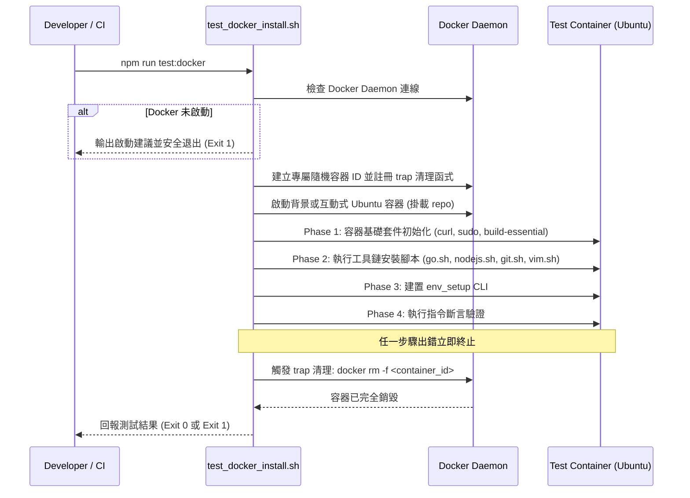

# Docker 容器套件安裝與指令測試設計規格 (Docker Container Install & Test Design)

## 1. 背景與動機 (Background & Motivation)

`env_setup` 專案提供跨平台（macOS / Ubuntu）開發環境初始化、工具鏈安裝與系統指令支援。為了避免本機環境污染並確保 Ubuntu 工具鏈安裝腳本（Go, Node.js, Git, Vim 等）與 `env_setup` Go CLI 的可用性，需要一套自動化、隔離且具備完整生命週期管理的 Docker 容器測試機制。該機制需在執行完畢或中斷時，保證刪除測試容器，不殘留系統資源。

## 2. 目標與非目標 (Goals & Non-Goals)

### 目標 (Goals)
- **容器自動化生命週期 (Container Lifecycle Automation)**：透過腳本自動拉起乾淨 Ubuntu 測試容器，並在測試完成（成功或失敗）及接收中斷訊號（`SIGINT`, `SIGTERM`）時，透過 `trap` 保證立即刪除容器。
- **套件與工具鏈安裝測試 (Package Installation Testing)**：在全新容器內依序測試核心開發工具鏈安裝腳本（`scripts/go.sh`, `scripts/nodejs.sh`, `scripts/git.sh`, `scripts/vim.sh`）與 `env_setup` CLI 建置。
- **指令功能斷言 (Command Functionality Assertion)**：驗證安裝後的指令執行狀態，包含 `go version`, `node -v`, `npm -v`, `git --version`, `vim --version` 以及 `env_setup system os show` 等 CLI 呼叫。
- **統一任務整合 (Unified Task Integration)**：透過 `package.json` 整合 `npm run test:docker` 與 `scripts/test_docker_install.sh`，符合專案統一介面慣例。
- **Daemon 前置偵測 (Daemon Preflight Check)**：在執行前檢查 Docker daemon 連線狀態，若未啟動則提示友善指示。

### 非目標 (Non-Goals)
- 不測試需硬體存取的 macOS 專有指令（如 `diskutil`, `system_profiler`, macOS keyboard dump 等）。
- 不在一般 `npm test` 中強制綁定 Docker 測試，避免本機未安裝或未啟動 Docker 時阻礙單元測試。

## 3. 系統架構與生命週期 (Architecture & Lifecycle)

## 4. 詳細執行流程 (Execution Flow)

### 4.1 Phase 1: 前置檢查與容器建立 (Preflight & Initialization)
1. 檢查本機 `docker` 指令與 Docker daemon（例如 Docker Desktop, Colima, OrbStack）是否可通訊。
2. 產生獨立測試容器名稱（例如 `env_setup_test_<timestamp>_<random>`）。
3. 註冊 Shell `trap 'cleanup' EXIT INT TERM`：
   - 於 `cleanup` 函式中呼叫 `docker rm -f "${CONTAINER_NAME}" >/dev/null 2>&1 || true`。
4. 使用官方 `ubuntu:24.04`（或 LTS）基礎映像檔啟動容器。

### 4.2 Phase 2: 容器內基礎環境準備 (Container Base Setup)
在容器內執行非互動式基礎工具配置：
- 更新 APT 索引並安裝 `sudo`, `curl`, `ca-certificates`, `tar`, `build-essential`。
- 設定基礎使用者環境變數（如 `USER`、`HOME`）。

### 4.3 Phase 3: 目標工具鏈安裝 (Toolchain Installation)
執行 repo 內針對 Linux/Ubuntu 的安裝腳本：
- `scripts/go.sh`：安裝指定版本 Go 並配置鎖版路徑。
- `scripts/nodejs.sh`：安裝 Node.js 與 npm。
- `scripts/git.sh`：安裝並配置 Git。
- `scripts/vim.sh`：安裝 Vim 與相關環境。
- `go build -o tmp/env_setup .`：建置原生 CLI。

### 4.4 Phase 4: 指令執行功能斷言 (Command Assertions)
依序檢查各安裝指令是否存在並能正常返回非空結果：
- `go version`
- `node -v`
- `npm -v`
- `git --version`
- `vim --version`
- `./tmp/env_setup system os show`
- `./tmp/env_setup system cpu show`

若任一斷言失敗，輸出對應錯誤訊息並以非零狀態碼結束，由 `trap` 觸發強制刪除容器。

### 4.5 Phase 5: 容器清理與銷毀 (Container Destruction)
腳本結束時自動執行清理函式，確保容器無殘留。

## 5. 檔案結構變更 (File Structure Impact)

- **新增**：`scripts/test_docker_install.sh`（單一職責：Docker 容器測試執行器與清理器）。
- **修改**：`package.json`（新增 `"test:docker": "bash scripts/test_docker_install.sh"`）。
- **新增**：`docs/superpowers/specs/2026-09-13-docker-container-test-design.md`（規格文件）。
- **新增**：`docs/superpowers/plans/2026-09-13-docker-container-test.md`（實作計畫）。

## 6. 錯誤處理與邊界案例 (Error Handling & Edge Cases)

1. **Docker Daemon 未啟動**：腳本精準捕捉錯誤，列印啟動指引（如提示 `colima start` 或啟動 Docker Desktop），並退出。
2. **網路中斷或下載逾時**：在容器內安裝工具（如 Go 或 Node tarball）時若遭遇網路問題，腳本非零退出，`trap` 確保容器銷毀。
3. **使用者中途 Ctrl+C**：`trap` 攔截 `INT` 訊號並立即強制刪除容器。
