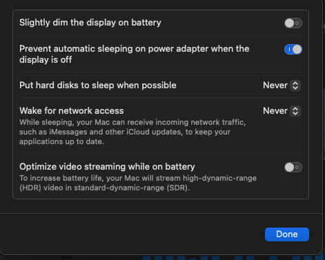

# USB Disk Can't be mounted

The Transcend USB Flash Drive is unable to mount across multiple OS, windows, linux, and Mac in the beginning.

Later, found windows randomly successes for USB 3 Type C->A

And plug on Ubuntu, also show with USB 3 Type C->C

=> the USB 3 wire has front and back side. Have to plugin correct side, then it works.

Mac is due to the spin down time. Should make no sleep for disk drive. System settings -> Battery ->

